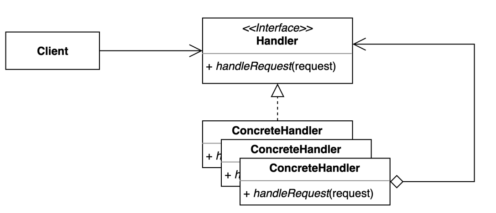

# chain of responsibility pattern
- 요청을 보내는 쪽(sender)과 요청을 처리하는 쪽(receiver)의 분리하는 패턴

```text
• 클라이언트 코드를 변경하지 않고 새로운 핸들러를 체인에 추가할 수 있다. 
• 각각의 체인은 자신이 해야하는 일만 한다. 
• 체인을 다양한 방법으로 구성할 수 있다
```

### 구조 및 기본 코드


```java
public interface Handler {
    void handleRequest(String request);
}
```

```java
public class ConcreteHandler1 implements Handler {

    private final Handler next;
    public ConcreteHandler1(Handler next) {
        this.next = next;
    }

    @Override
    public void handleRequest(String request) {
        next.handleRequest(request);
    }
}
```

### Login process 
> 비지니스 설명 
> 사용자가 URL을 입력하면 각각 체인들이 분석을 시도하여 Url 객체를 돌려준다

#### Handler
```java
public abstract class Handler {

    protected Handler nextHandler = null;

    public Handler setHandler(Handler handler) {
        this.nextHandler = handler;
        return handler;
    }

    protected abstract void process(Url url);

    public void run(Url url) {
        process(url);
        if (nextHandler != null) {
            nextHandler.run(url);
        }
    }
}
```

#### Client
```java
public class Client {

    public static Url run(String url) {
        Url url1 = new Url(url);
        Handler handler = getHandlerFilter();
        handler.run(url1);
        return url1;
    }

    private static Handler getHandlerFilter() {
        Handler domainHandler = new DomainHandler();
        Handler portHandler = new PortHandler();
        Handler protocolHandler = new ProtocolHandler();

        portHandler.setHandler(domainHandler);
        protocolHandler.setHandler(portHandler);

        return protocolHandler;
    }
}
```