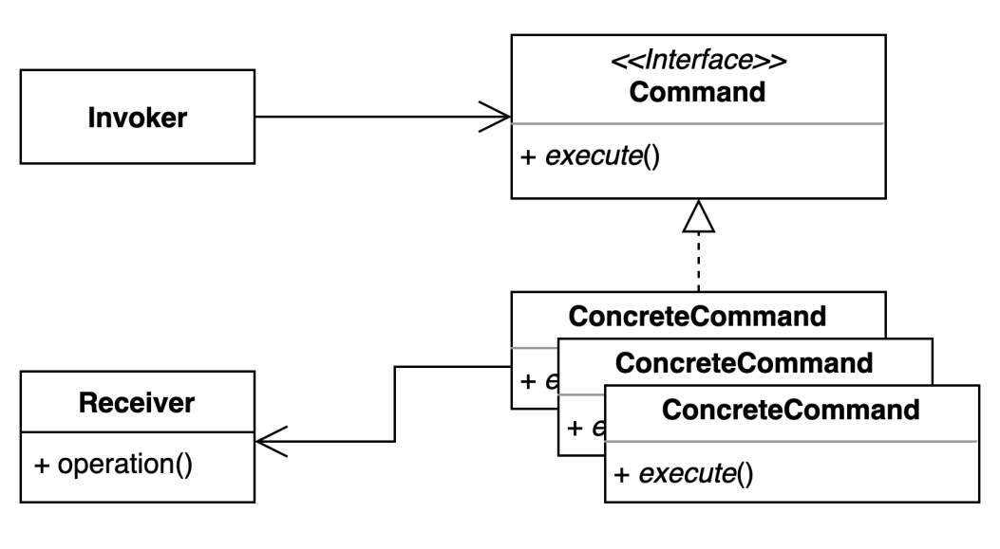

# command pattern
- 요청을 캡슐화 하여 호출자(invoker)와 수신자(receiver)를 분리하는 패턴

### 구조 및 기본 코드


```java
public class Receiver {
    public void run() {
        System.out.println("hello command");
    }
}
```
```java
public interface Command {
    void execute();
}
```
```java
public class ConcreteCommand implements Command {
    @Override
    public void execute() {
        Receiver receiver = new Receiver();
        receiver.run();
    }
}
```
```java
public class Invoker {
    private Command command;
    public void setCommand(Command command) {
        this.command = command;
    }
    public void executeCommand() {
        command.execute();
    }
}
```

### Coffee 주문 키오스크 예제
> 비지니스 설명
> 1. 고객은 바리스타를 요청하지 않고 키오스크로 주문을 합니다.
> 2. Kiosk는 주문 정보를 가지고 바리스타에게 전달한다.
> 3. 바리스타가 교체되어도 고객이 주문하는 방식은 변하지 않는다.

```java
class CommandTest {
    @DisplayName("키오스크로 아이스아메리카노를 주문한다.")
    @Test
    void takeOrderAmericano() {
        // given
        Order order = new AmericanoOrder();
        Kiosk kiosk = new Kiosk();
        kiosk.setOrder(order);

        // when
        Coffee coffee = kiosk.takeOrder();

        // then
        Assertions.assertThat(coffee).isEqualTo(Coffee.AMERICANO);
    }
}
```