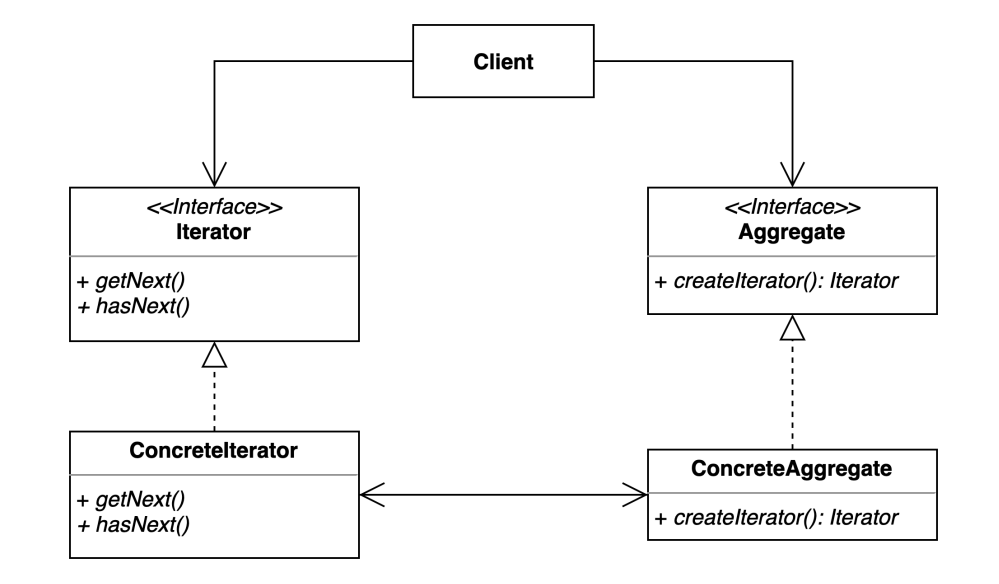

# interator pattern
- 집합 객체 내부 구조를 노출시키지 않고 순회 하는 방법을 제공하는 패턴

### 구조 및 기본 코드 


#### Iterator : java.util에서 제공하는 Iterator interface 를 활용
```java
public interface Iterator<E> {

    boolean hasNext();

    E next();
}
```

```java
public class ConcreteIterator<T> implements Iterator {
    List<? extends T> list;
    private int nextIndex = 0; // 커서 (for문의 i 변수 역할)
    // 생성자로 순회할 컬렉션을 받아 필드에 참조 시킴
    public ConcreteIterator(List<? extends T> list) {
        this.list = list;
    }
    @Override
    public boolean hasNext() {
        return nextIndex < list.size();
    }

    @Override
    public Object next() {
        return list.get(nextIndex++);
    }
}
```

#### Iterable -> java.lang 에 있는 인터페이스로 대체
```java
public interface Iterable<T> {
    Iterator<T> iterator();
}
```

```java
public class ConcreteAggregate<T> implements Iterable{

    List<T> list = new ArrayList<>();
    public ConcreteAggregate() {
    }
    public void add(T o) {
        list.add(o);
    }

    @Override
    public Iterator iterator() {
        return new ConcreteIterator(list);
    }
}
```