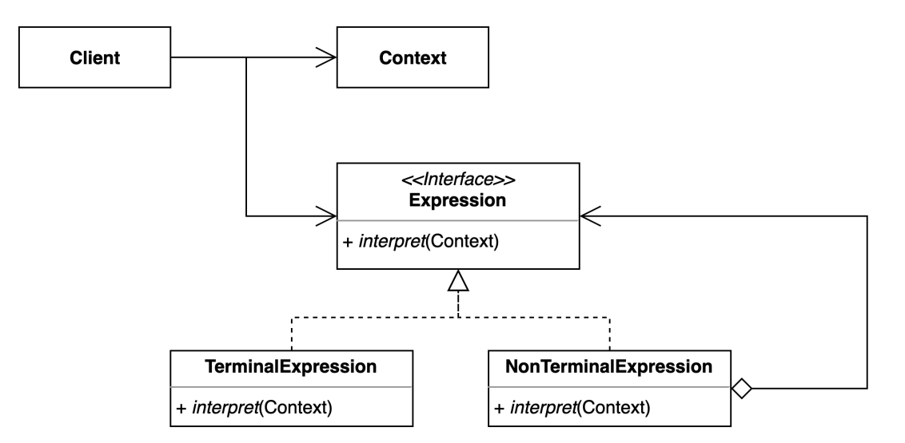

# interpreter pattern
- 자주 등장하는 문제를 간단한 언어로 정의하고 재사용하는 패턴

### 구조 및 기본 코드 


```java
public class Context {
    public Map<Character, Integer> mapper;
    public Context(Map<Character, Integer> mapper) {
        this.mapper = mapper;
    }
}
```

```java
public interface Expression {
    int interpret(Context context);
}
```
#### TerminalExpression 
```java
public class TerminalExpression implements Expression {
    private final Expression left;
    private final Expression right;
    public TerminalExpression(Expression left, Expression right) {
        this.left = left;
        this.right = right;
    }
    @Override
    public int interpret(Context context) {
        return left.interpret(context) * right.interpret(context);
    }
}
```

```java
public class NonTerminalExpression implements Expression {
    private final char value;
    public NonTerminalExpression(char value) {
        this.value = value;
    }
    @Override
    public int interpret(Context context) {
        return context.mapper.get(value);
    }
}
```