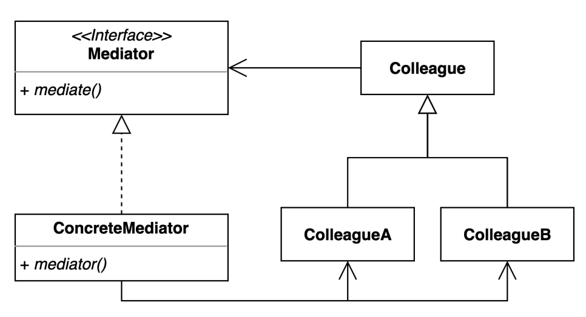

# mediator pattern
- 여러 객체들이 소통하는 방법을 캡슐화하는 패턴
- 서로 연관관계를 가질 수 있어 조심할 필요가 있다.

### 구조 및 기본 코드



#### Mediator
```java
public interface Mediator {
    String mediate(Colleague self);
}
```

#### ConcreteMediator
```java
public class ConcreteMediator implements Mediator {

    private Colleague colleagueA;
    private Colleague colleagueB;

    public void setColleagues(Colleague colleagueA, Colleague colleagueB) {
        this.colleagueA = colleagueA;
        this.colleagueB = colleagueB;
    }
    @Override
    public String mediate(Colleague self) {
        String comment = self == colleagueA ? colleagueB.getName() : colleagueA.getName();
        return "hello " + comment;
    }
}
```


#### Colleague
```java
public abstract class Colleague {

    private final Mediator mediator;
    public Colleague(Mediator mediator) {
        this.mediator = mediator;
    }

    public String call() {
        return mediator.mediate(this);
    }

    protected abstract String getName();
}
```


#### ColleagueA
```java
public class ColleagueA extends Colleague {

    private final String name = "ColleagueA";

    public ColleagueA(Mediator mediator) {
        super(mediator);
    }

    @Override
    public String getName() {
        return name;
    }
}
```

### 호텔 프론트데스크 샘플
> 비지니스 설명
> 1. W호텔에는 프론트데스크가 중재자 역할을 수행한다
> 2. 고객은 체크인 후 Cleaning, Dinner 요청을 프로트데스크를 통해 할 수 있다
> 3. 편의시설에서는 요청을 받으면서 고객의 방을 알 수 있고, 서비스를 제공한다 (서비스 제공은 간단한게 그방의 객체를 인자로 받아서)

#### FrontDesk
```java
public class FrontDesk {
    List<Guest> guests = new ArrayList<>();
    List<Service> services = new ArrayList<>();

    public Guest checkIn(String name) {
        Guest guest = new Guest(this, name, createRoomId());
        guests.add(guest);
        return guest;
    }

    public void checkOut(Guest guest) {
        guests.remove(guest);
    }

    public void dinner(Guest guest) {
        orderService(ServiceType.DINNER).requestDinner(guest);;
    }

    public void cleaning(Guest guest) {
        orderService(ServiceType.CLEANING).requestCleaning(guest);
    }

    private Service orderService(ServiceType serviceType) {
        return services.stream()
                .filter(service -> service.support(serviceType))
                .findFirst()
                .orElseThrow(() -> new IllegalStateException());

    }

    private static String createRoomId() {
        return UUID.randomUUID().toString().substring(10);
    }

    public void openService(Service service) {
        services.add(service);
    }
}
```