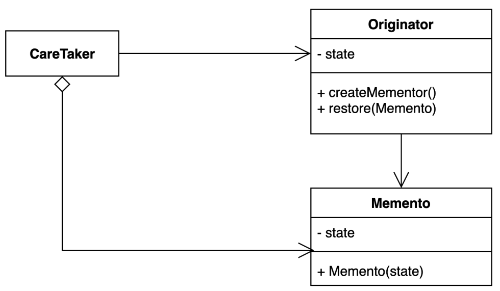

# memento pattern
- 캡슐화를 유지하면서 객체 내부 상태를 외부에 저장하는 방법

### 구조 및 기본 코드 


#### Originator
```java
public class Originator {
    private String state;
    public void setState(String state) {
        this.state = state;
    }
    public String getState() {
        return state;
    }
    public Memento save() {
        return new Memento(state);
    }
    public void restore(Memento memento) {
        this.state = memento.state();
    }
}
```

#### Mememto: 내가 좋아하는 Record
```java
public record Memento(String state) {
}
```

#### CareTaker
```java
public class CareTaker {
    private final Originator originator;
    private Stack<Memento> history = new Stack<>();
    public CareTaker(Originator originator) {
        this.originator = originator;
    }
    public void undo() {
        if (history.size() == 0) {
            throw new NullPointerException();
        }
        originator.restore(history.pop());
    }
    public void doSomething() {
        history.push(originator.save());
    }
}
```

#### Game Stage 상태 저장 
> 비지니스 설명
> 간단한 게임을 Save, Load 할 수 있는 기능이 있다
> Stage, 캐릭터의 상태(HP, MP) 등을 저장하는 기능을 제공한다.
> 총 3개의 세이브 파일을 저장하고 다시 로그할 수 있다.
 
```java
public class CareTaker {

    private SaveFile[] saveFiles = new SaveFile[3];

    public void save(GameState gameState, int index) {
        SaveFile save = gameState.save();
        saveFiles[index] = save;
    }

    public void load(GameState gameState, int index) {
        SaveFile saveFile = saveFiles[index];
        if(saveFile == null) throw new IllegalStateException();
        gameState.load(saveFile);
    }
}
```