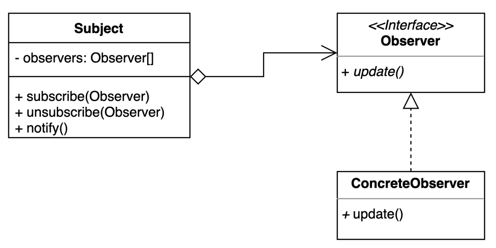

# observer pattern
- 다수의 객체가 특정 객체 상태 변화를 감지하고 알림을 받는 패턴

### 구조 및 기본 코드 


- 구독자에게 코스피가 변경되는 경우 알려준다.
####  Subject : 
```java
public class Subject {
    private Set<Observer> observers = new HashSet<>();

    public void subscribe(Observer observer) {
        observers.add(observer);
    }
    public void unsubscribe(Observer observer) {
        observers.remove(observer);
    }
    public void notify2(int kospi) {
        observers.forEach(observer -> observer.update(kospi));
    }
}
```
####  Observer
```java
public interface Observer {
    void update(int kospi);
}
```
#### ConcreteObserver
```java
public class ConcreteObserver implements Observer {

    private int kospi;

    @Override
    public int getKospi() {
        return kospi;
    }

    @Override
    public void update(int kospi){
        this.kospi = kospi;
    }
}
```