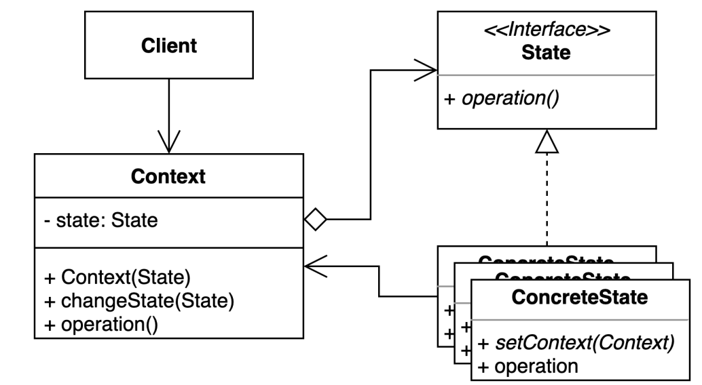

# state pattern
- 객체 내부 상태 변경에 따라 객체의 행동이 달라지는 패턴
- 기존의 특정 상태에 따른 동작을 변경하지 않고 새로운 상태에 다른 동작을 추가할 수 있다

### 구조 및 기본 코드 




#### Context
```java
public class Context {
    private State state;
    public Context(State state) {
        this.state = state;
    }
    public void changeState(State state) {
        this.state = state;
    }
    public void operation() {
        state.operation();
    }
}
```
#### State
```java
public interface State {
    void operation();
}
```
#### ConcreteState1,2
```java
public class ConcreteState1 implements State{
    @Override
    public void operation() {
        System.out.println("ConcreteState1 call");
    }
}
```

### ATM 샘플
> 비지니스 설명
> ATM은 상태(점검, 정상, 종료) 에 따라 처리 프로세스가 상이하다
> 정상인 경우 인출과 잔액조회 가능
> 점검인 경우 잔액조회만 되고 종료인 경우 전부 불가하다
> 추가적인 상태가 생기더라고 client 수정 없이 확장이 가능하다. 

```java
public class AtmService {

    private final Map<String, Integer> balance;
    private final State NORMAL;
    private final State INSPECTION;
    private final State FINISH;
    private State state;

    public AtmService(Map<String, Integer> balance) {
        this.balance = balance;
        this.NORMAL = new Normal();
        this.INSPECTION = new Inspection();
        this.FINISH = new Finish();
        this.state = FINISH;
    }

    public int balance(String username) {
        return state.balance( balance.get(username));
    }
    public int withdraw(String username, int money) {
        Integer balance = this.balance.get(username);
        int withdraw = state.withdraw(balance, money);
        this.balance.put(username, balance - withdraw);
        return withdraw;
    }

    public void startInspection() {
        this.state = INSPECTION;
    }

    public void finishAtm() {
        this.state = FINISH;
    }
    public void startAtm() {
        this.state = NORMAL;
    }
}
```
```java
public class Normal implements State{
    @Override
    public int withdraw(int balance, int money) {
        return money;
    }

    @Override
    public int balance(int balance) {
        return balance;
    }
}
```