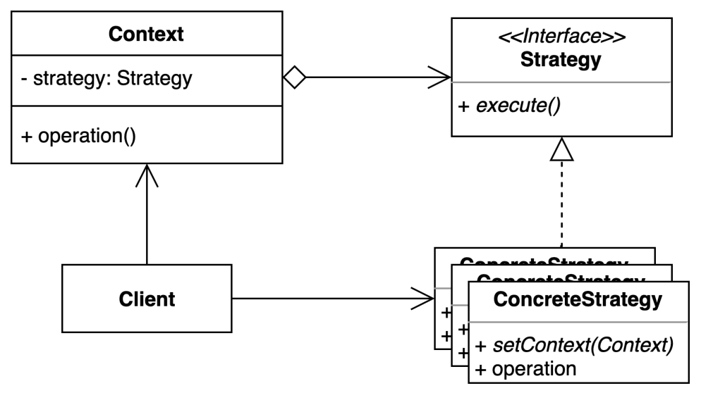

# state pattern
- 여러 알고리듬을 캡슐화하고 상호 교환 가능하게 만드는 패턴

### 구조 및 기본 코드



#### Context
```java
public class Context {
    private final Strategy strategy;
    public Context(Strategy strategy) {
        this.strategy = strategy;
    }
    public void operation() {
        strategy.execute();
    }
}
```

#### Strategy
```java
public interface Strategy {
    void execute();
}
```

####  ConcreteStrategy1,2
```java
public class ConcreteStrategy1 implements Strategy {
    @Override
    public void execute() {
        System.out.println("ConcreteStrategy1 call");
    }
}
```

### 축구게임 샘플
> 비지니스 설명
> 광진구 FC에 감독으로 선임되었고, 2가지 전략을 가지고 있다. 
> 특정 전략을 변경하여도 다른 전략에는 영향이 없도록 하자.
> 공격전략 : 4-4-2, 수비전략 5-4-2 전략