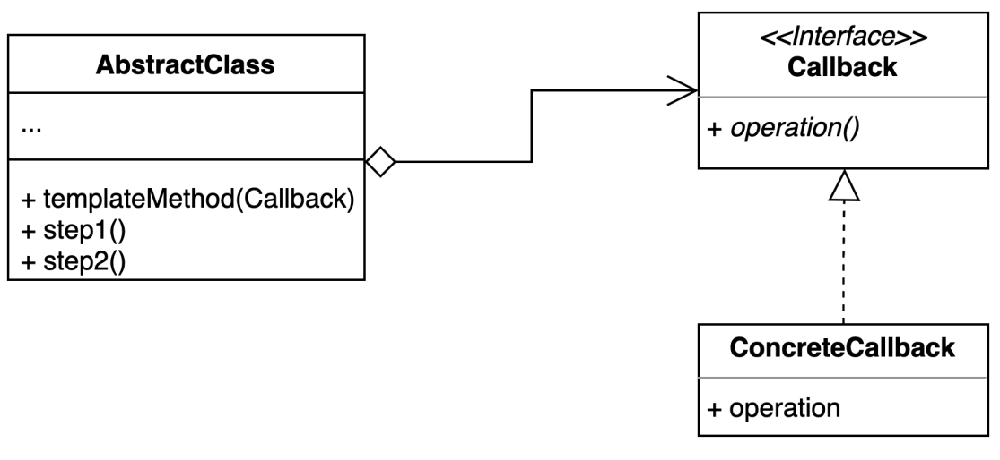

# template callback pattern
- 콜백으로 상속 대신 위임을 사용하는 템플릿 패턴

### 구조 및 기본 코드 

 


### Calculator 샘플
> 비지니스 설명
> 실제 operation은 서브클래스에서 지정한다.

```java
public class CalculatorTemplate {
    public int calculator(CalculatorCallback callback, int x, int y){
        return callback.operation(x, y);
    }
}
```

```java
class TemplateCallbackTest {

    @DisplayName("템플릿 콜백 패턴을 람다로 직접 생성한다.")
    @Test
    void multipleCalculatorCallbackTest(){
        // given
        CalculatorTemplate calculatorTemplate = new CalculatorTemplate();
        int ret = calculatorTemplate.calculator((x, y) -> x * y, 10, 20);

        Assertions.assertThat(ret).isEqualTo(200);
    }
}
```