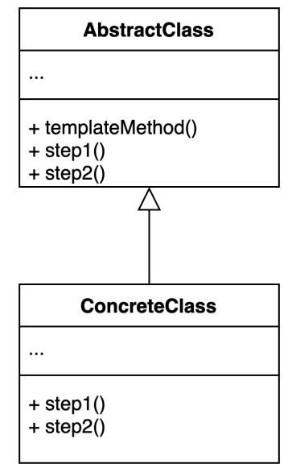

# template method pattern
- 알고리듬 구조를 서브 클래스가 확장할 수 있도록 템플릿으로 제공하는 방법

### 구조 및 기본 코드 
 


#### AbstractClass
```java
public abstract class AbstractClass {
    void templateMethod() {
        step1();
        step2();
    }
    abstract void step1();
    abstract void step2();
}
```

#### ConcreteClass
```java
public class ConcreteClass extends AbstractClass {
    @Override
    void step1() {
        System.out.println("step1 call");
    }
    @Override
    void step2() {
        System.out.println("step2 call");
    }
}
```

### Calculator 샘플
> 비지니스 설명
> 실제 operation은 서브클래스에서 지정한다.

```java
public abstract class CalculatorTemplate {
    public int calculator(int x, int y){
        return operation(x, y);
    }
    protected abstract int operation(int x, int y);
}
```
```java
public class PlusCalculator extends CalculatorTemplate {
    @Override
    public int operation(int x, int y) {
        return x + y;
    }
}
```