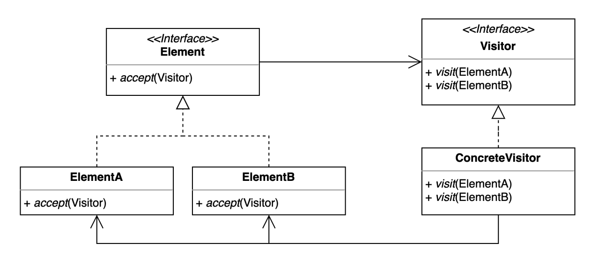

# visitor pattern
- 기존 코드를 변경하지 않고 새로운 기능을 추가하는 방법 (더블 디스패치)

### 구조 및 기본 코드


#### Element
```java
public interface Element {
    void accept(Visitor visitor);
}
```


#### ElementA
```java
public class ElementA implements Element {
    @Override
    public void accept(Visitor visitor) {
        visitor.visit(this);
    }
}
```

#### Visitor
```java
public interface Visitor {
    void visit(ElementA elementA);

    void visit(ElementB elementB);
}
```

#### ConcreteVisitor
```java
public class ConcreteVisitor implements Visitor {
    @Override
    public void visit(ElementA elementA) {
        System.out.println("visit elementA");
    }
    @Override
    public void visit(ElementB elementB) {
        System.out.println("visit elementB");
    }
}
```