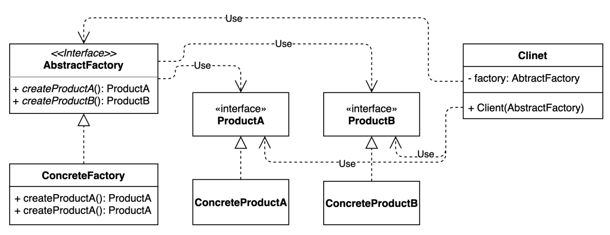

# abstract factory
- 관련 객체들의 구상 클래스들을 지정하지 않고도 관련 객체들의 모음을 생성할 수 있도록 하는 생성패턴

### 구조 및 기본 코드


#### AbstractFactory
```java
public interface AbstractFactory {
    ProductA createProductA();
    ProductB createProductB();
}
```
#### ConcreteFactory
```java
public class ConcreteFactory implements AbstractFactory {

    @Override
    public ProductA createProductA() {
        return new ConcreteProductA();
    }
    @Override
    public ProductB createProductB() {
        return new ConcreteProductB();
    }
}
```

#### Client
```java
public class Client {

    private final AbstractFactory factory;
    private ProductA productA;
    private ProductB productB;
    public Client(AbstractFactory factory) {
        this.factory = factory;
    }

    public void createProducts() {
        this.productA = factory.createProductA();
        this.productB = factory.createProductB();
    }

    public ProductA getProductA() {
        return productA;
    }

    public ProductB getProductB() {
        return productB;
    }
}
```

### 자동차 공장 예제
> 비지니스 설명 : 
> 1. 자동차 공장이 있는데 여기서는 가솔린, 경유 2종류의 제품을 만든다고 가정한다. 
> 2. 자동차의 세부 부품은 엔진과 핸들만 존재한다고 가정한다. 
> 3. 엔진은 가솔린과 경유에 따라 다르지만 핸들은 일반 핸들만 생성한다고 가정한다.
> 4. 만약에 가솔린차지만 수퍼핸들을 가진 차를 추가로 생성한다고했을때 기존 소스의 수정의 거의 없다는 것을 확인할 수 있다.

#### test code
```java
public class AbstractFactoryTest{
    
    @DisplayName("가솔린 차의 엔진은 가솔린 엔진에 일반 핸들이다.")
    @Test
    void createGasoline(){
        // given
        // Car 객체의 세부적인 정보없이 Factory 클래스으로 부품 클래스까지 생성한다
        CarFactory carFactory = new GasolineCarFactory();

        // when
        Car car = carFactory.createCar();

        // then
        assertThat(car.engin().enginType()).isEqualTo(EnginType.GASOLINE);
        assertThat(car.handle().handleType()).isEqualTo(HandleType.NORMAL);
    }
}
```