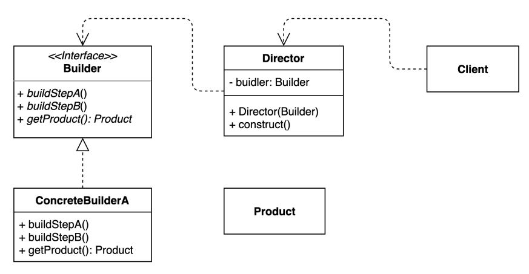

# builder pattern 
- 동일한 프로세스를 거쳐 다양한 구성의 인스턴스를 만드는 방법
- 자바, 스프링 소스에 builder라고 적혀있는 것은 대부분 Builder 패턴을 사용한 생성자이다.

### 구조 및 기본 코드 


#### Builder
```java
public interface Builder {
    Builder buildStepA(String text);
    Builder buildStepB(String text);
    Product getProduct();
}
```
#### ConcreteBuilderA
```java
public class ConcreteBuilder implements Builder {
    private String itemA, itemB;
    @Override
    public Builder buildStepA(String text) {
        this.itemA = text;
        return this;
    }
    @Override
    public Builder buildStepB(String text) {
        this.itemB = text;
        return this;
    }
    @Override
    public Product getProduct() {
        return new Product(this.itemA, this.itemB);
    }
}
```
#### Director
```java
public class Director {
    private final Builder builder;
    public Director(Builder builder) {
        this.builder = builder;
    }
    public Product construct() {
        return builder.buildStepA("itemA")
                .buildStepB("itemB")
                .getProduct();
    }
}
```

### 피자 만들기
> 비지니스 설명:
> 1. 피자는 기본적으로 토핑은 동일하게 여러가지 선택할 수 있다. 
> 2. 피자는 뉴욕피자, 칼초네 피자가 2가지가 있다
> 3. 뉴욕피자는 사이즈를 매개변수로 입력받고, 칼초네 피자는 찍먹, 부먹을 선택할 수 있다

#### Pizza
```java
public abstract class Pizza {
    public Set<Topping> getToppingSet() {
        return toppingSet;
    }

    public enum Topping {HAM, MUSHROOM, ONION, SAUSAGE}
    private final Set<Topping> toppingSet;

    abstract static class Builder<T extends Builder<T>>{
        EnumSet<Topping> toppings = EnumSet.noneOf(Topping.class);

        public T addTopping(Topping topping) {
            toppings.add(topping);
            return self();
        }

        abstract Pizza build();

        protected abstract T self();
    }

    public Pizza(Builder<?> builder) {
        this.toppingSet = builder.toppings.clone();
    }
}
```

#### NyPizza
```java
public class NyPizza extends Pizza {

    public enum Size {SMALL, MEDIUM, LARGE}

    private final Size size;

    public Size getSize() {
        return size;
    }

    public static class Builder extends Pizza.Builder<Builder> {

        private final Size size;
        public Builder(Size size) {
            this.size = size;
        }

        @Override
        public Pizza build() {
            return new NyPizza(this);
        }

        @Override
        protected Builder self() {
            return this;
        }
    }

    public NyPizza(Builder builder) {
        super(builder);
        this.size = builder.size;
    }
}
```