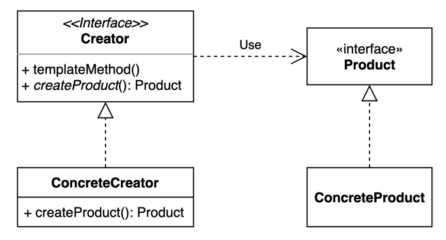

# factory method pattern 
- 구체적으로 어떤 인스턴스를 만들지는 서브 클래스가 정한다.
- 팩토리 메소드 패턴은 객체 생성을 공장(Factory) 클래스로 캡슐화 처리하여 대신 생성하게 하는 생성 디자인 패턴이다.
- 즉, 클라이언트에서 직접 new 연산자를 통해 제품 객체를 생성하는 것이 아닌, 제품 객체들을 도맡아 생성하는 공장 클래스를 만들고, 이를 상속하는 서브 공장 클래스의 메서드에서 여러가지 제품 객체 생성을 각각 책임 지는 것이다.

### 구조 및 기본 코드 
- 그림에서 templateMethod 의 역할을 이해하지 못하였고, Creator는 interface가 아닌 추상클래스를 사용 


#### Creator
```java
public abstract class Creator {
    private void templateMethod(){
        // 공통으로 수행되는 작업
    }
    public Product create(){
        this.templateMethod();
        return createProduct();
    }
    
    protected abstract Product createProduct();
}
```

#### ConcreteCreator
```java
public class ConcreteCreator extends Creator {

    @Override
    protected Product createProduct() {
        return new ConcreteProduct();
    }
}
```

#### test code
```java
class TemplateMethodTest {

    @DisplayName("template method pattern 으로 생성한다.")
    @Test
    void templateMethodTest(){
        // given
        Creator creator = new ConcreteCreator();

        // when
        Product product = creator.create();

        // then
        assertThat(product).isInstanceOf(ConcreteProduct.class);
    }
}
```

### Enum 을 활용한 팩토리메서드 패턴
```java
public enum CreatorEnum {

    Product {
        protected Product createProduct() {
            return new ConcreteProduct();
        }
    },
    ProductNull {
        protected Product createProduct() {
            return null;
        }
    };

    public Product create() {
        templateMethod(); // 공통의 사전작업
        return createProduct();
    }

    abstract protected Product createProduct();

    private void templateMethod() {
        // 공통으로 수행되는 작업
    }
}
```


