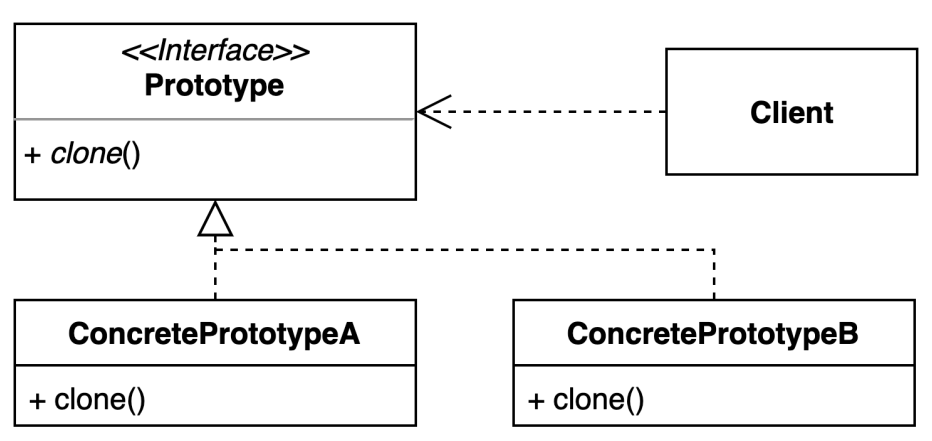

# prototype pattern 
- 기존 인스턴스를 복제하여 새로운 인스턴스를 만드는 방법

### 구조 및 기본 코드 


#### Prototype
```java
public interface Prototype {
    Prototype clone();

    String getText();
}
```

#### ConcretePrototypeA
```java
public class ConcretePrototypeA implements Prototype {

    private final String text;

    @Override
    public String getText() {
        return text;
    }

    public ConcretePrototypeA(String text) {
        this.text = text;
    }

    private ConcretePrototypeA(ConcretePrototypeA concretePrototypeA) {
        this.text = concretePrototypeA.text;
    }
    @Override
    public Prototype clone() {
        return new ConcretePrototypeA(this);
    }

}
```

### Cloneable 인터페이스 사용 
```text
clone 메소드는 Object 클래스의 정의 되어 있음
Cloneable 인터페이스는 마커 인터페이스로 clone 에 의해 복사할 수 있다' 라는 표시  
(단 super.clone() 사용시에는 CloneNotSupportedException이 발생한다)
```
> 비지니스 업무
> 1. FakeDate 라는 year, month, day 를 가지고 있는 클래스가 있다.
> 2. 이를 계산하기는 쉽지않다고 가정한다.
> 3. 이를 새로 생성시에 복사기능을 통해 데이터를 복사할 수 있다.

```java
public record FakeDate (
    int year,
    int month,
    int date
) implements Cloneable {

    @Override
    public Object clone() throws CloneNotSupportedException {
        return new FakeDate(this.year, this.month, this.date);
    }
}
```
 

### shallow copy와 deep copy
> 얕은 복사(Shallow copy)는 참조 타입 데이터가 저장한 '메모리 주소 값'을 복사한 것을 의미한다.
> 반대로 깊은 복사(Deep copy)는 새로운 메모리 공간을 확보해 완전히 복사하는 것을 의미한다

### ModelMapper
> 자바 리플렉션을 통해 Model copy 기능 제공하는 라이브러리
