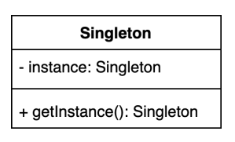

# singleton pattern 
- 인스턴스를 오직 한개만 제공하는 클래스로 여러가지 방법으로 만들 수 있다.
- 동시성과 불필요한 인스턴스 생성등을 고려하여 구현 필요 

### 2. 구조 및 기본 코드


```java
public final class Singleton {
    private Singleton() {
        // 객체를 외부에서 생성못하게 private 로 지정
    }

    private static class SingletonHolder {
        private final static Singleton INSTANCE = new Singleton();
    }

    public static Singleton getInstance() {
        return SingletonHolder.INSTANCE;
    }
}
```