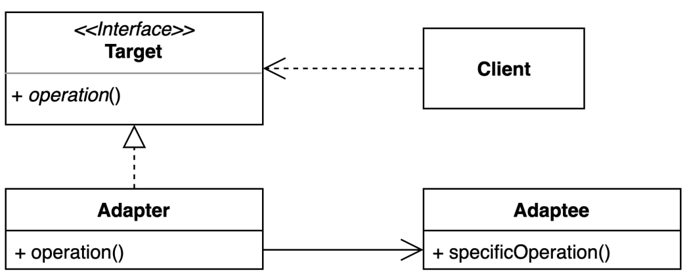

# adapter pattern 
- 기존 코드를 클라이언트가 사용하는 인터페이스의 구현체로 바꿔주는 패턴

### 구조 및 기본 코드


#### Target
 ```java
public interface Target {
    void operation();
}
```

#### Adapter
```java
public class Adapter implements Target {
    private Adaptee adaptee = new Adaptee();
    @Override
    public void operation() {
        adaptee.specificOperation();
    }
}
```
#### Adaptee
```java
public class Adaptee {
    public void specificOperation() {
        System.out.println("adaptee specificOperation call");
    }
}
```

### 외부 API
> 비지니스 설명:
> 1. 입력한 숫자가 odd, even 인지 알려주는 간단한 API가 존재한다
> 2. 그런데 미국, 중국 2개의 API를 구매해서 사용하는데 실제 사용시에는 동일한 형태로 사용하고 싶다
> 3. 미국API 결과를 odd, even 내려주는데 우리 프로그램을 홀, 짝으로 결과을 받아야 한다
> 4. 중국API는 스펙이 차이가 있어 odd 일떄 결과를 true로 내려준다

#### UsEvenAdapter
```java
public class UsEvenAdapter implements EvenAdapter {

    private final Map<String, String> converter = Map.of("even", "짝수",  "odd", "홀수");

    @Override
    public String operation(int number) {
        String ret = UsApi.run(number);
        return converter.getOrDefault(ret, "짝수");
    }
    
    // 미국 API 계산기
    private static abstract class UsApi {
        static String run(int number) {
            return number % 2 == 0 ? "even" : "odd";
        }
    }
}
```

#### ChinaEvenAdapter
```java
public class ChinaEvenAdapter implements EvenAdapter {
    @Override
    public String operation(int number) {
        boolean ret = ChinaApi.go(number);
        return ret ? "짝수" : "홀수";
    }

    private static abstract class ChinaApi {
        static boolean go(int number) {
            return number % 2 == 0;
        }
    }
}
```