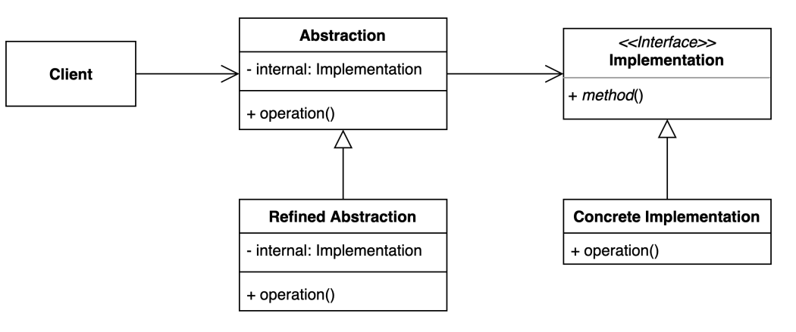

# bridge pattern 
- 추상적인 것과 구체적인 것을 분리하여 연결하는 패턴

### 구조 및 기본 코드 



#### Abstraction
```java
public class Abstraction {
    private final Implementation implementation;
    public Abstraction(Implementation implementation) {
        this.implementation = implementation;
    }
    String operation(){
        return implementation.method();
    }
}
```

#### RefinedAbstraction
```java
public class RefinedAbstraction extends Abstraction{
    public RefinedAbstraction(Implementation implementation) {
        super(implementation);
    }
    @Override
    String operation() {
        return super.operation() + "|추가기능";
    }
}
```

#### Implementation
```java
public interface Implementation {
    String method();
}
```

#### ConcreteImplementation
```java
public class ConcreteImplementation implements Implementation {
    @Override
    public String method() {
        return "기본기능";
    }
}
```

#### 일반리모콘 + 향상된리모콘
> 비지니스 설명
> 1. TV, Radio에서 사용되는 리모콘이 있다
> 2. 일반 리모콘은 볼륨 +/- 기능만 제공한다.
> 3. 향상된 리모콘은 추가로 Mute 기능을 제공한다. (TV만 사용할 수 있다)