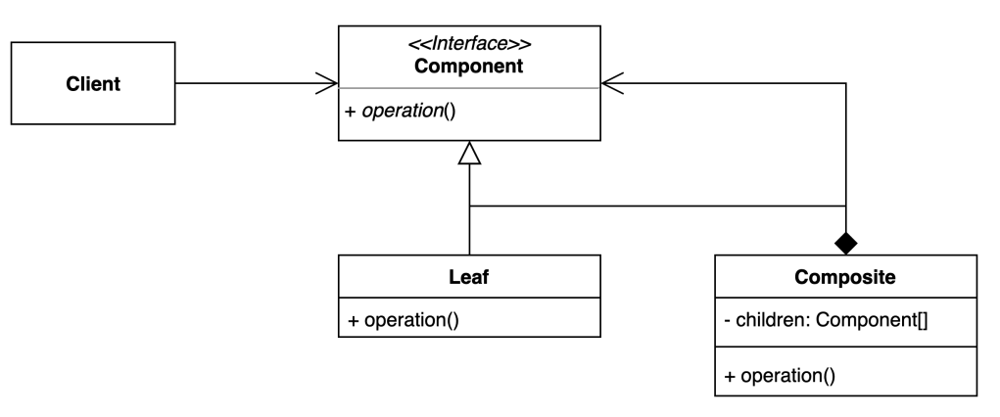

# composite pattern 
- 그룹 전체와 개별 객체를 동일하게 처리할 수 있는 패턴

### 구조 및 기본 코드  


#### Component
```java
public interface Component {
    void operation();
}
```

#### Leaf
```java
public class Leaf implements Component {
    @Override
    public void operation() {
        System.out.println("Hello Leaf!!");
    }
}
```

#### Composite
```java
public class Composite implements Component {
    private final Component[] children;
    public Composite(Component[] children) {
        this.children = children;
    }
    @Override
    public void operation() {
        System.out.println("Hello Composite!!");
        Arrays.stream(children).forEach(Component::operation);
    }
}
```

### 가방의 무게를 측정하는 예제
> 비지니스 설명
> 가방에는 여러개의 아이템이 들어갈 수 있고, 가방도 아이템에 포함된다.
> 아이템들도 각자의 무게를 가지고 있다.
> 아이템에 무게를 측정할 수 있고, 가방의 무게를 측정하면 아이템의 무게도 같이 측정한다. 