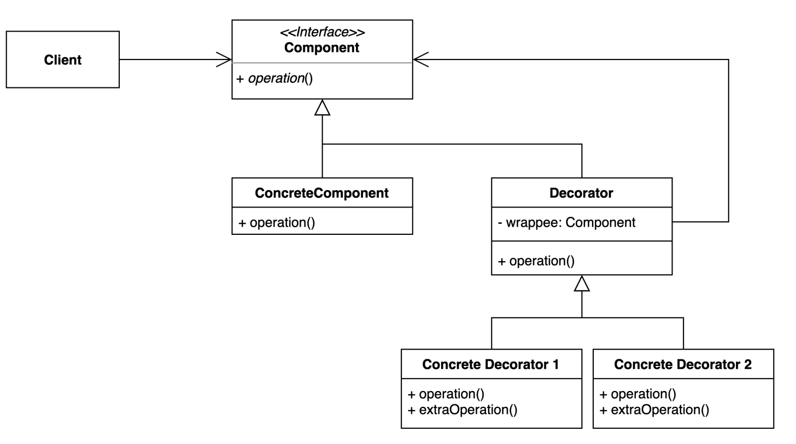

# decorator pattern 
- 기존 코드를 변경하지 않고 부가 기능을 추가하는 패턴

### 구조 및 기본 코드   


#### Component
```java
public interface Component {
    String operation(String text);
}
```
#### ConcreteComponent
```java
public class ConcreteComponent implements Component {
    @Override
    public String operation(String text) {
        return text;
    }
}
```
#### Decorator
```java
public abstract class Decorator implements Component {

    protected final Component wrappee;
    public Decorator(Component wrappee) {
        this.wrappee = wrappee;
    }
}
```

#### ConcreteDecorator1 : 소문자 변환
```java
public class ConcreteDecorator1 extends Decorator {

    public ConcreteDecorator1(Component wrappee) {
        super(wrappee);
    }

    @Override
    public String operation(String text) {
        return wrappee.operation(toLowerCase(text));
    }

    private String toLowerCase(String text) {
        return text.toLowerCase(Locale.ROOT);
    }
}
```

#### ConcreteDecorator2: trim 변환
```java
public class ConcreteDecorator2 extends Decorator {

    public ConcreteDecorator2(Component wrappee) {
        super(wrappee);
    }

    @Override
    public String operation(String text) {
        return wrappee.operation(trim(text));
    }

    private String trim(String text) {
        return text.trim();
    }
}
```
