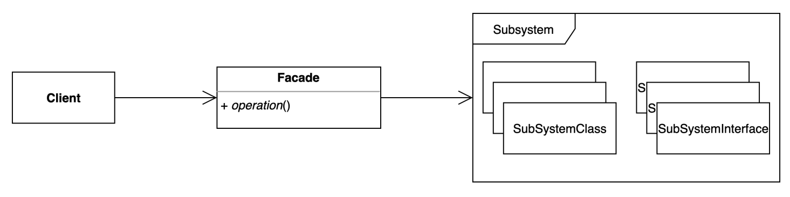

# facade pattern 
- 복잡한 서브 시스템 의존성을 최소화하는 방법.
- 사용자 입장에는 시스템 상세 내용은 모르는 상태에서 수행되는 형태

### 구조 및 기본 코드   


#### Facade
```java
public interface Facade {
    void operation();
}
```

#### ConcreteFacade
```java
public class ConcreteFacade implements Facade {

    private final SubSystemA subSystemA = new SubSystemA();
    private final SubSystemB subSystemB = new SubSystemB();
    
    @Override
    public void operation() {
        subSystemA.operationA();
        subSystemB.operationB();
    }
}
```