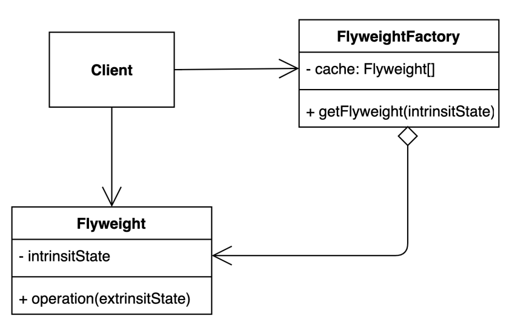

# flyweight pattern
- 객체를 가볍게 만들어 메모리 사용을 줄이는 패턴
```text
자주 변하는 속성(또는 외적인 속성, extrinsit)과 변하지 않는 속성(또는 내적인 속성,
intrinsit)을 분리하고 재사용하여 메모리 사용을 줄일 수 있다
```

### 구조 및 기본 코드


#### Flyweight
```java
public record Flyweight(String intrinsitState) {

    public String operation(String extrinsitState) {
        return this.intrinsitState + "-" + extrinsitState;
    }
}
```

#### FlyweightFactory
```java
public class FlyweightFactory {

    Set<Flyweight> cache = new HashSet<>();

    public Flyweight getFlyweight(String intrinsitState) {
        return cache.stream()
                .filter(flyweight -> intrinsitState.equals(flyweight.intrinsitState()))
                .findAny()
                .orElseGet(() -> createFlyweight(intrinsitState));
    }
    private Flyweight createFlyweight(String intrinsitState) {
        Flyweight flyweight = new Flyweight(intrinsitState);
        cache.add(flyweight);
        return flyweight;
    }
}
```

### Font sample 
> 변하지 않는 font 를 가지고 자주 변하는 Text를 분리하여 메모리 사용양을 줄이는 방법

```java
public record Font(Color color, int size) {
    public String operation(String comment) {
        return String.format("[%s] %s", color.name(), comment);
    }
}
```

```java
public class FontFactory {

    private Map<String, Font> cache = new ConcurrentHashMap();

    public Font getFont(Color color, int size) {

        String fontKey = String.format("%s:%n", color.name(), size);
        if (cache.containsKey(fontKey)) {
            return cache.get(fontKey);
        }
        return createFont(color, size, fontKey);

    }

    private Font createFont(Color color, int size, String fontKey) {
        Font newFont = new Font(color, size);
        cache.put(fontKey, newFont);
        return newFont;
    }
}
```