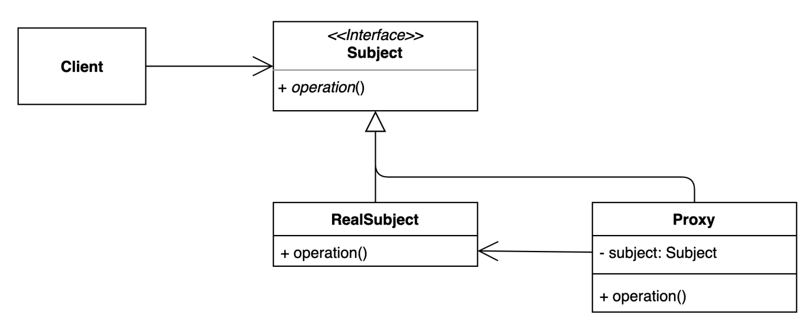

# proxy pattern
- 특정 객체에 대한 접근을 제어하거나 기능을 추가할 수 있는 패턴


### 구조 및 기본 코드



```java
public interface Subject {
    String operation(String comment);
}
```
```java
public class RealSubject implements Subject {
    @Override
    public String operation(String comment) {
        return comment;
    }
}
```

```java
public class Proxy implements Subject {

    private final Subject subject;
    public Proxy(Subject subject) {
        this.subject = subject;
    }

    // trim 기능
    @Override
    public String operation(String comment) {
        return subject.operation(comment.trim());
    }
}
```